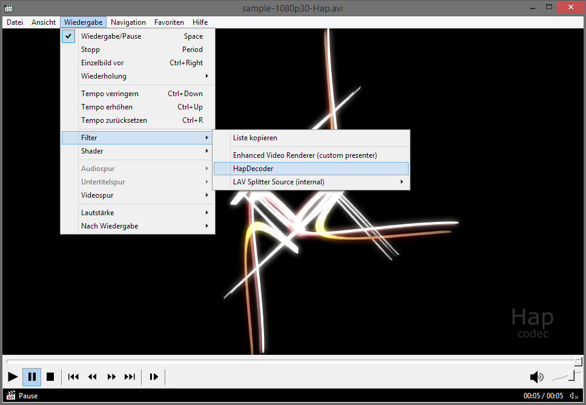

# HapDecoder
A simple DirectShow video decoder filter that decodes HAP video (Hap1, Hap Alpha, Hap Q).

Like Renderheads VfW codec, it can either decode to RGB32 (using libsquish, i.e. CPU, and therefor slow) or pass the raw compressured textures (DXT1, DXT5, DXTY) to any other filter (renderer/grabber) that can handle them.

Unlike the Renderheads codec, it also supports HAP video encoded by FFmpeg, and in addition to AVI it also supports other containers like MOV and MKV if you use a third party splitter filter like e.g. the LAV Splitter/LAV Splitter source filter.

Note: this first version is still alphaish.

Screenshots:

MPC-HC using HapDecoder to decode "sample-1080p30-Hap.avi":

