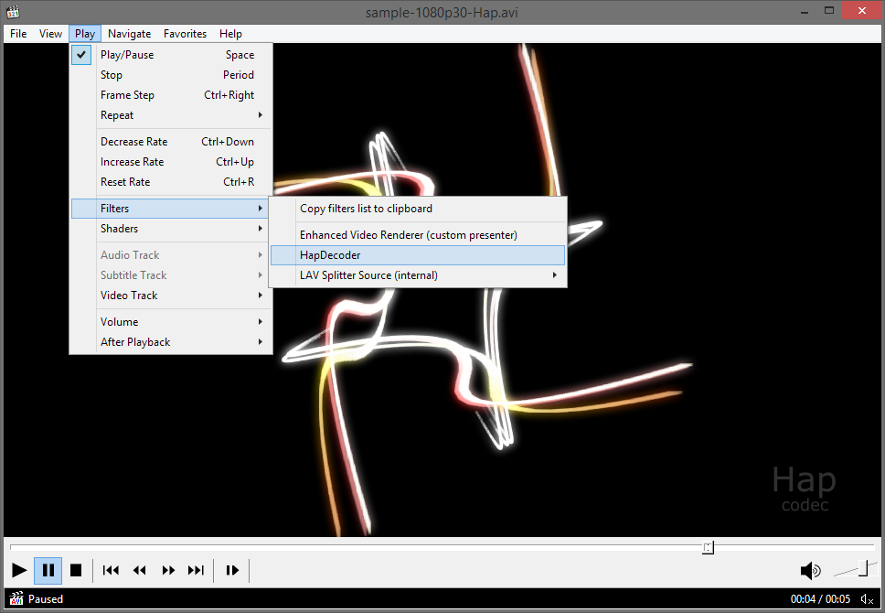

# HapDecoder
A simple DirectShow video decoder filter that decodes [HAP video](http://hap.video/) (Hap1, Hap Alpha, Hap Q).

Like [Renderheads VfW codec](https://github.com/Vidvox/hap-directshow), it can either decode to RGB32 (using lib [squish](https://github.com/Cavewhere/squish), i.e. CPU, and therefor slow) or pass the raw compressured textures (DXT1, DXT5, DXTY) to any other filter (renderer/grabber) that can handle them.

Unlike the Renderheads codec, it also supports HAP video encoded by [FFmpeg](https://github.com/FFmpeg/FFmpeg), and in addition to AVI it also supports other containers like MOV and MKV if you use a third party splitter filter like e.g. the [LAV Splitter/LAV Splitter source filter](https://github.com/Nevcairiel/LAVFilters).

For an actual application see [openFrameworks](https://github.com/openframeworks/openFrameworks) addon [ofxDirectShowDXTVideoPlayer](https://github.com/59de44955ebd/ofxDirectShowDXTVideoPlayer) which is based on it.

Screenshots:

[MPC-HC](https://github.com/mpc-hc/mpc-hc) using HapDecoder to decode "sample-1080p30-Hap.avi":

HapDecoder in GraphStudio, playing "sample-1080p30-HapQ.avi" (Hap Q) and passing the raw compressed textures (DXTY) to OpenGL (using [HapRenderer](https://github.com/59de44955ebd/HapRenderer)).

